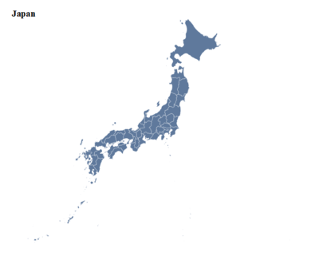
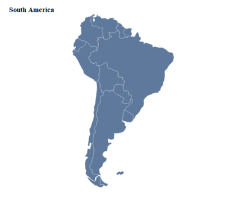
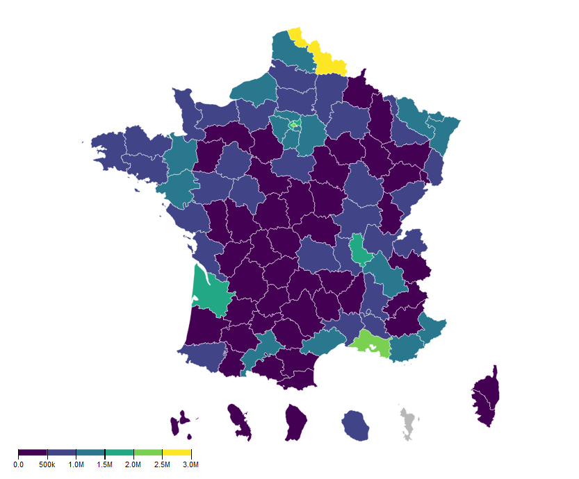
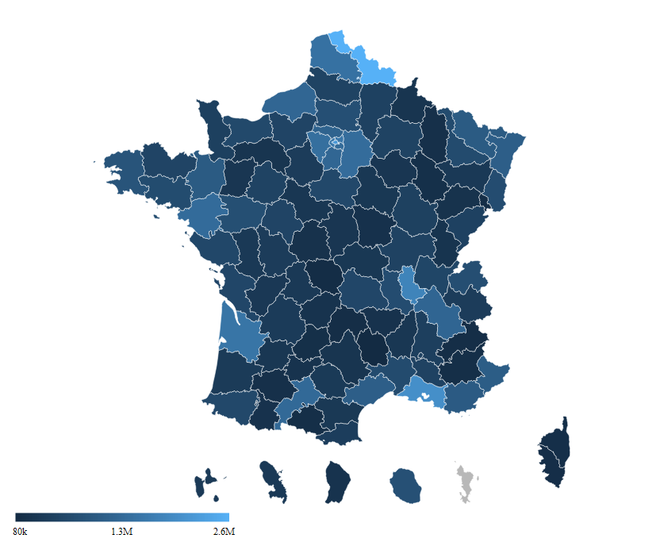
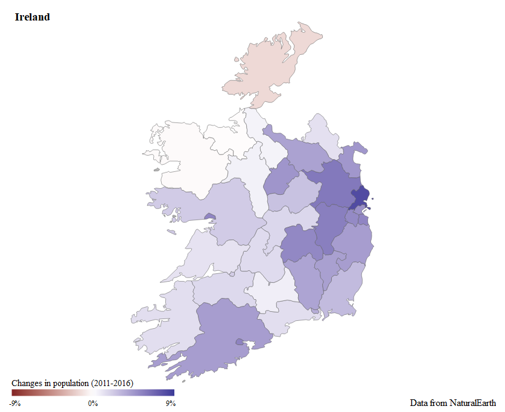
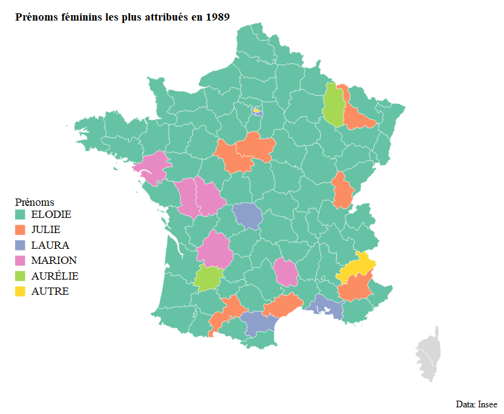

# r2d3maps

> Fun with [`r2d3`](https://github.com/rstudio/r2d3) and [`geojsonio`](https://github.com/ropensci/geojsonio) : draw D3 maps

[](https://travis-ci.org/dreamRs/r2d3maps)
[](http://www.repostatus.org/#wip)
[](https://www.tidyverse.org/lifecycle/#experimental)


## Installation

You can install from Github:

```r
source("https://install-github.me/dreamRs/r2d3maps")

# or with devtools:
devtools::install_github("dreamRs/r2d3maps")
```

## Basic examples

Create D3 maps from `sf` objects, try it with NaturalEarth map data from [`rnaturalearth`](https://github.com/ropenscilabs/rnaturalearth) :

```r
library( r2d3maps )
library( rnaturalearth )

### Japan
japan <- ne_states(country = "japan", returnclass = "sf")
d3_map(shape = japan) %>%
  add_labs(title = "Japan")

### South America
south_america <- ne_countries(continent = "south america", returnclass = "sf")
d3_map(shape = south_america) %>%
  add_labs(title = "South America")
```





## Choropleth map

### Continuous scale

There is two way to plot a continuous variable: by defining intervals or using a gradient.


```r
# Packages
library( r2d3maps )
library( sf )
library( CARTElette ) # devtools::install_github("antuki/CARTElette/CARTElette@RPackage")
library( dplyr )
library( rmapshaper )

# map data
dept <- loadMap(nivsupra = "DEP")      # shapes
dept <- st_transform(dept, crs = 4326) # changing coordinates
dept <- ms_simplify(dept)              # simplify shapes

# add population data
data("pop_fr", package = "r2d3maps")
dept <- left_join(
  x = dept,
  y = pop_fr,
  by = c("DEP" = "code_departement")
)

# draw map
d3_map(dept) %>%
  add_continuous_breaks(var = "population_totale", na_color = "#b8b8b8") %>%
  add_legend(d3_format = ".2s") %>%
  add_tooltip(value = "{nom} : {population_totale}")
```


With a gradient:

```r
d3_map(dept) %>%
  add_continuous_gradient(var = "population_totale") %>%
  add_legend(d3_format = ".2s") %>%
  add_tooltip(value = "{nom} : {population_totale}")
```



You can also use a diverging colour gradient:

```r
library( r2d3maps )
library( rnaturalearth )
library( dplyr )

# shapes
ireland <- ne_states(country = "ireland", returnclass = "sf")

# add data
data("pop_irl")
ireland <- left_join(
  x = ireland,
  y = pop_irl
)

# draw map
d3_map(shape = ireland, stroke_col = "#585858") %>%
  add_tooltip(value = "{woe_name}: {changes_percentage}%") %>% 
  add_continuous_gradient2(var = "changes_percentage", range = c(-9, 9)) %>% 
  add_legend(title = "Changes in population (2011-2016)", suffix = "%") %>% 
  add_labs(
    title = "Ireland",
    caption = "Data from NaturalEarth"
  )
```



### Discrete scale

Plot categorical variables, you can use a color palette or manual values:

```r
# map data
fr_dept <- ne_states(country = "france", returnclass = "sf")
fr_dept <- fr_dept[fr_dept$type_en %in% "Metropolitan department", ]

# firstnames data
data("prenoms_fr", package = "r2d3maps")
prenoms_fr_89 <- prenoms_fr %>%
  filter(annais == 1989, sexe == 2) %>%
  group_by(preusuel) %>%
  mutate(n = n()) %>%
  ungroup() %>%
  mutate(prenom = if_else(n < 2, "AUTRE", preusuel))

fr_dept <- left_join(
  x = fr_dept,
  y = prenoms_fr_89,
  by = "adm1_code"
)

# draw map
d3_map(shape = fr_dept) %>%
  add_discrete_scale(
    var = "prenom", palette = "Set2",
    labels_order = c(setdiff(unique(na.omit(fr_dept$prenom)), "AUTRE"), "AUTRE")
  ) %>%
  add_tooltip(value = "<b>{name}</b>: {prenom}", .na = NULL) %>%
  add_legend(title = "Prénoms") %>%
  add_labs(
    title = "Prénoms féminins les plus attribués en 1989",
    caption = "Data: Insee"
  )
```



### Make your own

Use `r2d3map` with an `sf` object to convert it to topojson and use a custom JavaScript script like in `r2d3`:

```r
library(r2d3maps)
library(rnaturalearth)

# Data ----
Indonesia <- ne_states(country = "Indonesia", returnclass = "sf")

# Map ----
r2d3map(
  data = Indonesia,
  script = "my_map.js"
)
```

Create a minimal template with `use_r2d3map`, this will create 3 scripts (R, JS & CSS) to draw maps:

```r
use_r2d3map("my_map.R")
```

