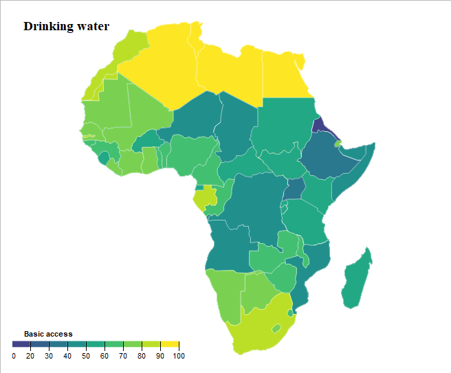
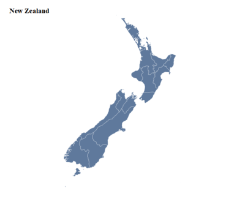
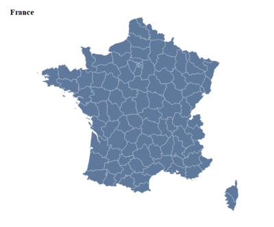
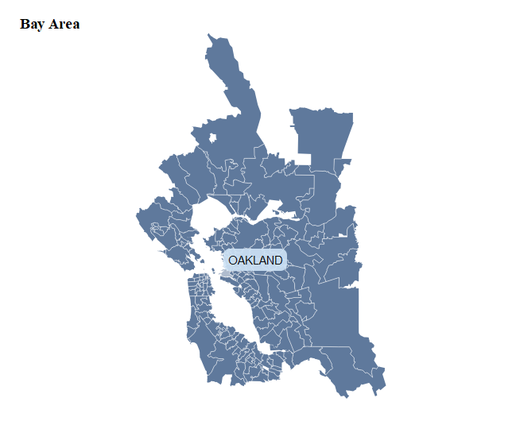
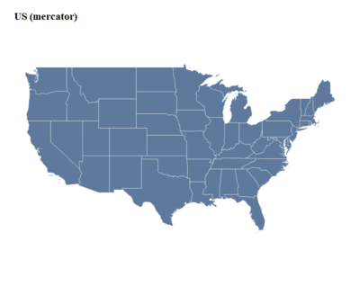
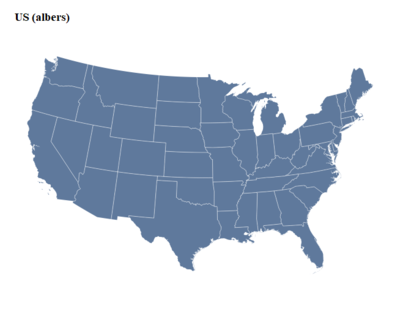
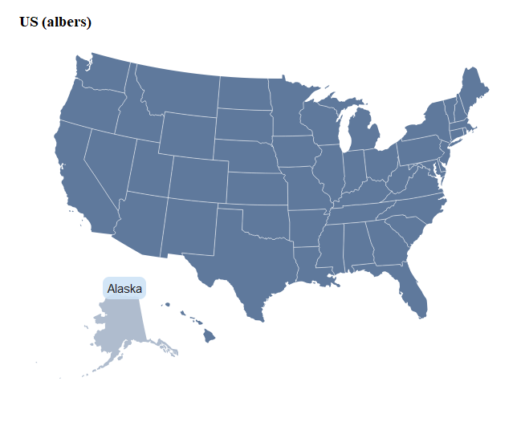
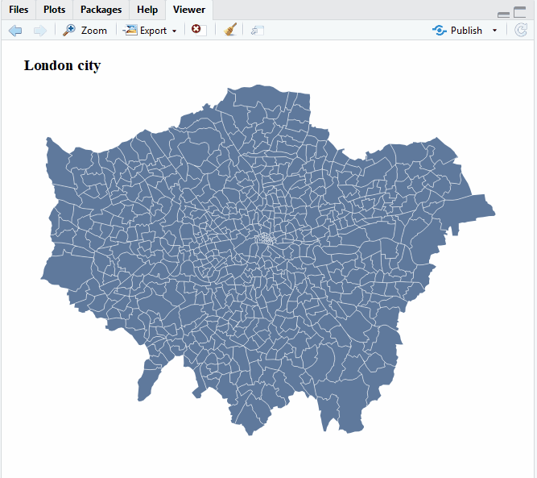

# r2d3maps

> Fun with [`r2d3`](https://github.com/rstudio/r2d3) and [`geojsonio`](https://github.com/ropensci/geojsonio) : draw D3 maps

[](https://travis-ci.org/dreamRs/r2d3maps)
[](http://www.repostatus.org/#wip)
[](https://www.tidyverse.org/lifecycle/#experimental)


## Installation

You can install from Github:

```r
source("https://install-github.me/dreamRs/r2d3maps")
```

## Examples

Create D3 maps from `sf` objects:




<br>

Try it with NaturalEarth map data from [`rnaturalearth`](https://github.com/ropenscilabs/rnaturalearth) :

```r
library( r2d3maps )
library( rnaturalearth )

### Japan
japan <- ne_states(country = "japan", returnclass = "sf")
d3_map(shape = japan) %>%
  add_labs(title = "Japan")


### New Zealand
nz <- ne_states(country = "New Zealand", returnclass = "sf")
nz <- sf::st_crop(nz, xmin = 159.104, ymin = -48.385, xmax = 193.601, ymax = -33.669)
d3_map(shape = nz) %>%
  add_labs(title = "New Zealand")
```





```r
library( r2d3maps )
library( rnaturalearth )

### South America
south_america <- ne_countries(continent = "south america", returnclass = "sf")
d3_map(shape = south_america) %>%
  add_labs(title = "South America")


### France
fr_dept <- ne_states(country = "france", returnclass = "sf")
fr_dept <- fr_dept[fr_dept$type_en %in% "Metropolitan department", ]

d3_map(shape = fr_dept) %>%
  add_labs(title = "France")
```





With a shapefile read by `sf` (data from [data.sfgov.org](https://data.sfgov.org/Geographic-Locations-and-Boundaries/Bay-Area-ZIP-Codes/u5j3-svi6)):

```r
library( r2d3maps )
library( sf )

bay_area <- read_sf("dev/bay-area/geo_export_bb694795-f052-42b5-a0a1-01db0b2d41a6.shp")

d3_map(shape = bay_area) %>%
  add_labs(title = "Bay Area") %>%
  add_tooltip(value = "{po_name}")
```




## Projection

Input data must be in WGS84, but you can use a different projection with D3:

```r
library( r2d3maps )
library( rnaturalearth )

us <- ne_states(country = "united states of america", returnclass = "sf")
us <- filter(us, !name %in% c("Alaska", "Hawaii"))

# Mercator
d3_map(shape = us) %>%
  add_labs(title = "US (mercator)")

# Albers
d3_map(shape = us, projection = "Albers") %>%
  add_labs(title = "US (albers)")
```





To bring back Alaska and Hawaii, see this [script](https://github.com/dreamRs/r2d3maps/blob/master/dev/us.R) (adapted from this [one](https://rud.is/b/2014/11/16/moving-the-earth-well-alaska-hawaii-with-r/) by [@hrbrmstr](https://github.com/hrbrmstr))





## Simplify polygons

To draw lot of polygons, consider using [`rmapshaper`](https://github.com/ateucher/rmapshaper) by [@ateucher](https://github.com/ateucher):


```r
library( sf )
library( rmapshaper )

# shapefiles from: https://data.london.gov.uk/dataset/statistical-gis-boundary-files-london

london <- read_sf("dev/London-wards-2014/London-wards-2014_ESRI/London_Ward.shp")
london <- st_transform(london, crs = 4326)

london2 <- ms_simplify(london)

# pryr::object_size(london)
# ##> 2.96 MB
# pryr::object_size(london2)
# ##> 532 kB

d3_map(shape = london2) %>%
  add_tooltip("{NAME}") %>%
  add_labs("London city")
```




